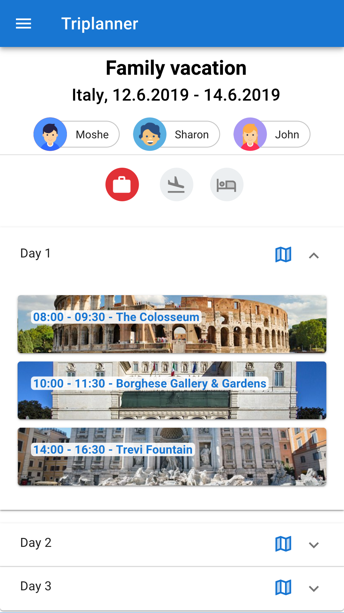
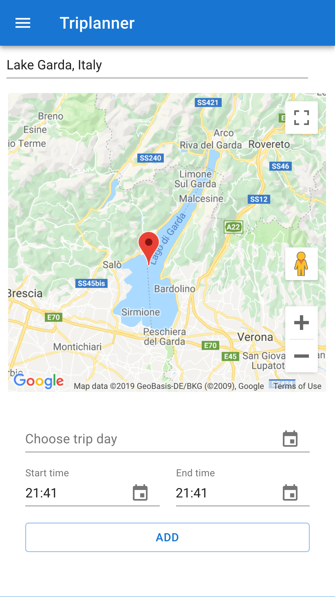
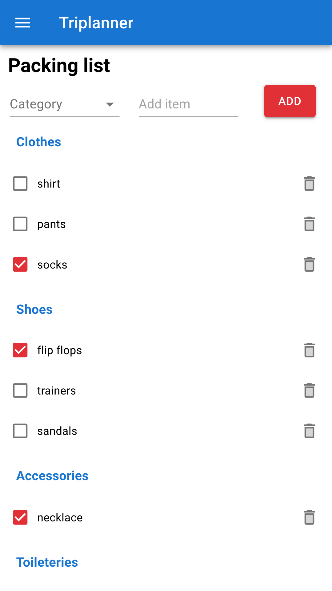
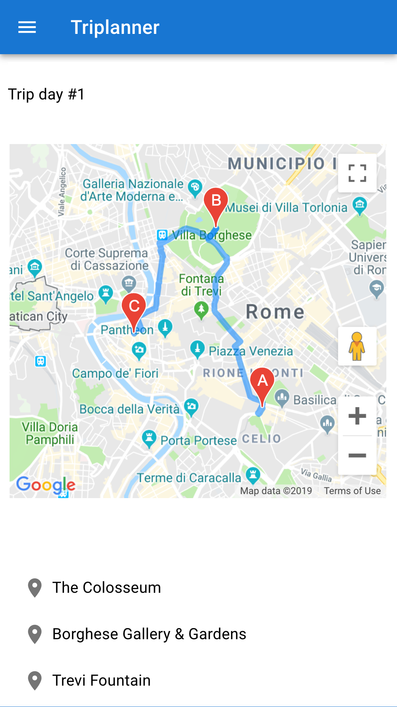

# Triplanner
Triplanner is a React PWA that will help you plan your trip, from saving your daily agenda to saving packing lists and notes, and let all your co-travelers be part of it.

Demo: https://reut-triplanner.herokuapp.com

## Table Of Contents
- [Triplanner](#triplanner)
  * [Running the project](#running-the-project)
  * [Screens](#screens)
    + [My Trip](#my-trip)
    + [New Attraction](#new-attraction)
    + [Packing List](#packing-list)
    + [Daily Route](#daily-route)
  * [Techstack](#techstack)
  * [TODO](#todo)

## Running the project
1. Clone the repo.
1. Run `npm install`.
1. Generate [Google Maps API key](https://developers.google.com/maps/documentation/javascript/get-api-key) and replace the current API key in line 23 in `public/index.html` file.
1. Run `npm run build`
1. Run `npm start`.
1. Navigate to `http://localhost:4000`.

## Screens

### My Trip
An overview of your trip, including your co-travelers, the trip information and the agenda for each day.

### New Attraction
Find your next attraction and add it to your trip.

### Packing List
Manage the trip's packing list.

### Daily Route
Map view for the attractions of each day.

## Techstack
1. React, Material-UI and axios.
1. Express (Node.js), Mongoose (MongoDB).
1. Google Maps, Places and Directions APIs; including usage of the device location (via browser's navigator).

## TODO
1. Create data seeders.
1. Enable multiple trips.
1. Add the ability to run the project in `watch` mode.
1. Flights and accommodations details.
1. Creating trails as you go.
1. Explore – attractions and hiking trails around you.
1. Weather forecast.